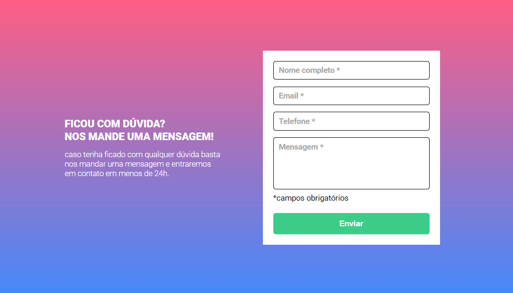

# Desafio DevQuest
## Quest - Formulário
Projeto feito no curso [DevQuest](https://www.linkedin.com/school/devquest-dev-em-dobro/?originalSubdomain=br).

## Índice

- [Visão Geral](#visão-geral)
  - [Objetivo](#objetivo)
  - [Screenshot](#screenshot)
  - [Links](#links)
  - [O que eu aprendi](#o-que-eu-aprendi)
- [Meus Contatos](#meus-contatos)
- [Agradecimentos](#agradecimentos)

## Visão geral

### Objetivo

- Fazer um formulário com validação dos campos com HTML, CSS e JavaScript 
- Adicionar cores e textos que ajudem o usuário na validação do formulário

### Screenshot

### Links

- Repositório: [Repositório Formulário](https://github.com/Leandro-Sousa-dev/quest-formulario)
- GitHub Pages: [Quest Formulário](https://leandro-sousa-dev.github.io/quest-formulario/)

### O que eu aprendi
- Nessa quest aprendi a utilizar melhor a tag de input com vários tipos de type
- Com a dica do monitor que me deu o feedback, utilizei o método preventDefault() para evitar o envio do formulário caso a validação esteja incorreta
- Usando preventDefault, também foi possível validar o que é digitado no input para evitar, por exemplo letras no campo de telefone. 

## Meus Contatos

- LikedIn - [José Leandro](https://www.linkedin.com/in/jos%C3%A9-leandro-7ba007261/)
- GitHub - [Meu GitHub Para mais projetos](https://github.com/Leandro-Sousa-dev)
- Frontend Mentor - [@Leandro-Sousa-dev](https://www.frontendmentor.io/profile/Leandro-Sousa-dev)

## Agradecimentos

- Dev Em Dobro - [YouTube](https://www.youtube.com/c/devemdobro)
- Monitor Pablo - [@PabloViana](https://github.com/pablovianas)